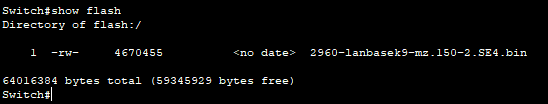

## Базовая настройка коммутатора
### Топология

### Таблица адресации

### Задачи
>#### Часть 1. Проверка конфигурации коммутатора по умолчанию

>#### Часть 2. Создание сети и настройка основных параметров устройства
>* Настройте базовые параметры коммутатора.
>* Настройте IP-адрес для ПК.
>#### Часть 3. Проверка сетевых подключений
>* Отобразите конфигурацию устройства.
>* Протестируйте сквозное соединение, отправив эхо-запрос.
>* Протестируйте возможности удаленного управления с помощью Telnet.
### Часть 1. Создание сети и проверка настроек коммутатора по умолчанию
В первой части лабораторной работы предстоит настроить топологию сети и проверить настройку коммутатора по умолчанию.
##### Шаг 1. Создайте сеть согласно топологии
    a. Подсоедините консольный кабель, как показано в топологии. На данном этапе не подключайте кабель Ethernet компьютера PC-A.
    b. Установите консольное подключение к коммутатору с компьютера PC-A с помощью Tera Term или другой программы эмуляции терминала.

>**Вопрос: Почему нужно использовать консольное подключение для первоначальной настройки коммутатора? Почему нельзя подключиться к коммутатору через Telnet или SSH?**

><em>Ответ: Потому что нет возможности подключиться к комутатору через Telnet или SSH без предварительной настройки</em>
    
##### Шаг 2. Проверьте настройки коммутатора по умолчанию
На данном этапе нужно проверить такие параметры коммутатора по умолчанию, как текущие настройки коммутатора, данные IOS, свойства интерфейса, сведения о VLAN и флеш-память.

a. Убедитесь, что на коммутаторе находится пустой файл конфигурации по умолчанию, с помощью команды show running-config привилегированного режима EXEC.

b. Изучите текущий файл running configuration

 

    Вопрос: Сколько интерфейсов FastEthernet имеется на коммутаторе 2960?
    Ответ: 24

    Вопрос: Сколько интерфейсов Gigabit Ethernet имеется на коммутаторе 2960?
    Ответ: 2

    Вопрос: Каков диапазон значений, отображаемых в vty-линиях?
    Ответ: 0-15

c. Изучите файл загрузочной конфигурации (startup configuration), который содержится в энергонезависимом ОЗУ (NVRAM)

    Вопрос: Почему появляется это сообщение?
    Ответ: Потому что нет установленной конфигурации

d. Изучите характеристики SVI для VLAN 1.

[//]: # (![img_5.png]&#40;img_5.png&#41;)

    Вопрос: Назначен ли IP-адрес сети VLAN 1?
    Ответ: нет

    Вопрос: Какой MAC-адрес имеет SVI?
    Ответ: 0004.9aec.a8a3

    Вопрос: Данный интерфейс включен?
    Ответ: нет

e. Изучите IP-свойства интерфейса SVI сети VLAN 1.

[//]: # (![img_3.png]&#40;img_3.png&#41;)

    Вопрос: Какие выходные данные вы видите?
    Ответ: 

f. Подсоедините кабель Ethernet компьютера PC к порту 6 на коммутаторе и изучите IP-свойства интерфейса SVI сети VLAN 1.

[//]: # (![img_2.png]&#40;img_2.png&#41;)

[//]: # (![img_8.png]&#40;images/img_8.png&#41;)

    Вопрос: Какие выходные данные вы видите?
    Ответ:

g.	Изучите сведения о версии ОС Cisco IOS на коммутаторе.

    Вопрос: Под управлением какой версии ОС Cisco IOS работает коммутатор?
    Ответ: 15.0(2)SE4

    Вопрос: Как называется файл образа системы?
    Ответ: flash:c2960-lanbasek9-mz.150-2.SE4.bin

h.	Изучите свойства по умолчанию интерфейса FastEthernet, который используется компьютером PC-A.

    Вопрос: Интерфейс включен или выключен?
    Ответ: включен

    Вопрос: Что нужно сделать, чтобы включить интерфейс?
    Ответ: Подключить провод

    Вопрос: Какой MAC-адрес у интерфейса?
    Ответ: 0001.c79a.e206

    Вопрос: Какие настройки скорости и дуплекса заданы в интерфейсе?
    Ответ: 100Mb/s Full duplex

i.	Изучите флеш-память.

    Вопрос: Какое имя присвоено образу Cisco IOS?
    Ответ: 2960-landbasek9-mz.150-2.SE4

### Часть 2. Настройка базовых параметров сетевых устройств
##### Шаг 1. Настройте базовые параметры коммутатора

a.	В режиме глобальной конфигурации скопируйте следующие базовые параметры конфигурации и вставьте их в файл на коммутаторе S1.
- no ip domain-lookup
- hostname S1
- service password-encryption
- enable secret class
- banner motd #
- Unauthorized access is strictly prohibited. #

b.	Назначьте IP-адрес интерфейсу SVI на коммутаторе. Благодаря этому вы получите возможность удаленного управления коммутатором.
Прежде чем вы сможете управлять коммутатором S1 удаленно с компьютера PC-A, коммутатору нужно назначить IP-адрес. Согласно конфигурации по умолчанию коммутатором можно управлять через VLAN 1.

c.	Доступ через порт консоли также следует ограничить  с помощью пароля. Используйте cisco в качестве пароля для входа в консоль в этом задании. Конфигурация по умолчанию разрешает все консольные подключения без пароля. Чтобы консольные сообщения не прерывали выполнение команд, используйте параметр logging synchronous.
S1(config)# line con 0
S1(config-line)# logging synchronous

d.	Настройте каналы виртуального соединения для удаленного управления (vty), чтобы коммутатор разрешил доступ через Telnet. Если не настроить пароль VTY, будет невозможно подключиться к коммутатору по протоколу Telnet.

    Вопрос: Для чего нужна команда login?
    Ответ: Для аутентификации при работе на устройстве

 

##### Шаг 2. Настройте IP-адрес на компьютере PC-A.

### Часть 3. Проверка сетевых подключений
##### Шаг 1. Отобразите конфигурацию коммутатора

a. Конфигурация приведена ниже.

 

b.	Проверьте параметры VLAN 1. 

    
    Вопрос: Какова полоса пропускания этого интерфейса?
    Ответ: 100000Kbit в секунду

[//]: # (![img_3.png]&#40;images/img_16.png&#41;)

##### Шаг 2. Протестируйте сквозное соединение, отправив эхо-запрос

##### Шаг 3. Проверьте удаленное управление коммутатором S1.

##### Вопросы для повторения:

    1. Вопрос: Зачем необходимо настраивать пароль VTY для коммутатора?
    Ответ: Для защиты от несанкционированного доступа к настройкам коммутатора

    2. Вопрос: Что нужно сделать, чтобы пароли не отправлялись в незашифрованном виде?
    Ответ: Использовать настройку service password encryption