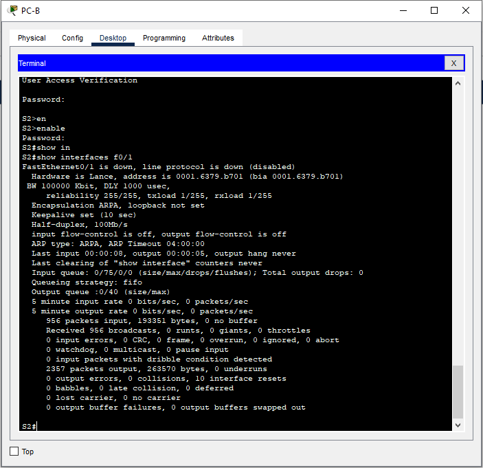

## Лабораторная работа. Просмотр таблицы MAC-адресов коммутатора

### Лабораторная работа. Просмотр таблицы MAC-адресов коммутатора 

### Топология

### Таблица адресации

|**Устройство**|**Интерфейс**|**IP-адрес**|**Маска подсети**|
| :-: | :-: | :-: | :-: |
|S1|VLAN 1|192\.168.1.11|255\.255.255.0|
|S2|VLAN 1|192\.168.1.12|255\.255.255.0|
|PC-A|NIC|192\.168.1.1|255\.255.255.0|
|PC-B|NIC|192\.168.1.2|255\.255.255.0|

### Задачи

>#### Часть 1. Создание и настройка сети**

>#### Часть 2. Изучение таблицы МАС-адресов коммутатора**

### Общие сведения/сценарий
Коммутатор локальной сети на уровне 2 предназначен для доставки кадров Ethernet всем узловым устройствам в локальной сети (LAN). Он записывает МАС-адреса узлов, отображаемые в сети, и сопоставляет их с собственными портами коммутатора Ethernet. Этот процесс называется созданием таблицы МАС-адресов. Получив кадр от ПК, коммутатор изучает МАС-адреса источника и назначения кадра. MAC-адрес источника регистрируется и сопоставляется с портом коммутатора, от которого он был получен. Затем по таблице MAC-адресов определяется МАС-адрес назначения. Если MAC-адрес назначения известен, кадр пересылается через соответствующий порт коммутатора, связанный с этим MAC-адресом. Если MAC-адрес неизвестен, то кадр отправляется по широковещательной рассылке через все порты коммутатора, кроме того, через который он был получен. Важно видеть и понимать работу коммутатора и то, как он осуществляет передачу данных по сети. Понимание функционала коммутатора особенно важно для сетевых администраторов, задача которых заключается в обеспечении безопасной и стабильной работы сети.

Коммутаторы используются для соединения компьютеров в локальных сетях (LAN) и передачи данных между ними. Коммутаторы отправляют кадры Ethernet на узловые устройства, которые идентифицируются по МАС-адресам сетевых плат.

В части 1 нужно построить топологию, состоящую из двух коммутаторов, соединенных транком. В части 2 предстоит отправить эхо-запросы различным устройствам и посмотреть, как два коммутатора строят свои таблицы МАС-адресов.

**Примечание.** В лабораторной работе используются коммутаторы Cisco Catalyst 2960s с операционной системой Cisco IOS 15.2(2) (образ lanbasek9). Допускается использование других моделей коммутаторов и других версий Cisco IOS. В зависимости от модели устройства и версии Cisco IOS доступные команды и результаты их выполнения могут отличаться от тех, которые показаны в лабораторных работах.

**Примечание**: Убедитесь, что все настройки коммутатора удалены и загрузочная конфигурация отсутствует. Если вы не уверены в этом, обратитесь к инструктору.

### Необходимые ресурсы
- 2 коммутатора (Cisco 2960 с операционной системой Cisco IOS 15.2(2) (образ lanbasek9) или аналогичная модель)
- 2 ПК (Windows и программа эмуляции терминала, такая как Tera Term)
- Консольные кабели для настройки устройств Cisco IOS через консольные порты.
- Кабели Ethernet, расположенные в соответствии с топологией

**Примечание.** Интерфейсы Fast Ethernet на коммутаторах Cisco 2960 определяют тип подключения автоматически, поэтому между коммутаторами S1 и S2 можно использовать прямой кабель Ethernet. При использовании коммутатора Cisco другой модели может потребоваться перекрестный кабель Ethernet.

### Инструкции
#### Часть 1. Создание и настройка сети
##### Шаг 1. Подключите сеть в соответствии с топологией.
##### Шаг 2. Настройте узлы ПК.
##### Шаг 3. Выполните инициализацию и перезагрузку коммутаторов.
##### Шаг 4. Настройте базовые параметры каждого коммутатора.
   >a. Настройте имена устройств в соответствии с топологией.

   >b. Настройте IP-адреса, как указано в таблице адресации.
   
   >c. Назначьте **cisco** в качестве паролей консоли и VTY.
   
   >d. Назначьте **class** в качестве пароля доступа к привилегированному режиму EXEC.

#### Часть 2. Изучение таблицы МАС-адресов коммутатора
Как только между сетевыми устройствами начинается передача данных, коммутатор выясняет МАС-адреса и строит таблицу.
##### Шаг 1. Запишите МАС-адреса сетевых устройств.
a. Откройте командную строку на PC-A и PC-B и введите команду **ipconfig /all**.

    Вопрос: Назовите физические адреса адаптера Ethernet.
    Ответ:  MAC-адрес компьютера PC-A: 0000.0CA6.0AB3
    Ответ:  MAC-адрес компьютера PC-B: 0001.C941.3725

b. Подключитесь к коммутаторам S1 и S2 через консоль и введите команду **show interface F0/1** на каждом коммутаторе.

    Вопрос: Назовите адреса оборудования во второй строке выходных данных команды (или зашитый адрес — bia).
    Ответ:  МАС-адрес коммутатора S1 Fast Ethernet 0/1: 000b.be18.c701
    Ответ:  МАС-адрес коммутатора S2 Fast Ethernet 0/1: 0001.6379.b701

##### Шаг 2. Просмотрите таблицу МАС-адресов коммутатора.
Подключитесь к коммутатору S2 через консоль и просмотрите таблицу МАС-адресов до и после тестирования сетевой связи с помощью эхо-запросов.

a. Подключитесь к коммутатору S2 через консоль и войдите в привилегированный режим EXEC.

b. В привилегированном режиме EXEC введите команду **show mac address-table** и нажмите клавишу ввода.

Даже если сетевая коммуникация в сети не происходила (т. е. если команда ping не отправлялась), коммутатор может узнать МАС-адреса при подключении к ПК и другим коммутаторам.

    Вопрос: Записаны ли в таблице МАС-адресов какие-либо МАС-адреса?
    Ответ: Да

    Вопрос: Какие МАС-адреса записаны в таблице? С какими портами коммутатора они сопоставлены и каким устройствам принадлежат?
    Ответ: В коммутаторе S1 на порту Fa0/1 записан mac-адрес коммутатора S2, а в коммутаторе S2 на порту Fa0/1 записан mac-адрес коммутатора S1 

Игнорируйте МАС-адреса, сопоставленные с центральным процессором.
   
   Если вы не записали МАС-адреса сетевых устройств в шаге 1, как можно определить, каким устройствам принадлежат МАС-адреса, используя только выходные данные команды **show mac address-table**? Работает ли это решение в любой ситуации?

##### Шаг 3. Очистите таблицу МАС-адресов коммутатора S2 и снова отобразите таблицу МАС-адресов.
a. В привилегированном режиме EXEC введите команду **clear mac address-table dynamic** и нажмите клавишу **Enter**.

b. Снова быстро введите команду **show mac address-table**.

    Вопрос: Указаны ли в таблице МАС-адресов адреса для VLAN 1? Указаны ли другие МАС-адреса?
    Ответ: Нет, не указаны

Через 10 секунд введите команду **show mac address-table** и нажмите клавишу ввода.

    Вопрос: Появились ли в таблице МАС-адресов новые адреса?
    Ответ: Запись появилась, новых MAC-адресов нет 

##### Шаг 4. С компьютера PC-B отправьте эхо-запросы устройствам в сети и просмотрите таблицу МАС-адресов коммутатора.
a. На компьютере PC-B откройте командную строку и еще раз введите команду **arp -a**.

    Вопрос: Не считая адресов многоадресной и широковещательной рассылки, сколько пар IP- и МАС-адресов устройств было получено через протокол ARP?
    Ответ: Нисколько

b. Из командной строки PC-B отправьте эхо-запросы на компьютер PC-A, а также коммутаторы S1 и S2.

    Вопрос: От всех ли устройств получены ответы? Если нет, проверьте кабели и IP-конфигурации.
    Ответ: Да, от всех
   
c. Подключившись через консоль к коммутатору S2, введите команду **show mac address-table**.

    Вопрос: Добавил ли коммутатор в таблицу МАС-адресов дополнительные МАС-адреса? Если да, то какие адреса и устройства?
    Ответ: Да, добавил: PC-B 0001.c941.3725, S1 f0/1 000b.be18.c701, S1 vlan1 0040.0b9b.c093, PC-A 0000.0ca6.0ab3

На компьютере PC-B откройте командную строку и еще раз введите команду **arp -a**.

    Вопрос: Появились ли в ARP-кэше компьютера PC-B дополнительные записи для всех сетевых устройств, которым были отправлены эхо-запросы?
    Ответ: Да, появились

##### Вопросы для повторения:
В сетях Ethernet данные передаются на устройства по соответствующим МАС-адресам. Для этого коммутаторы и компьютеры динамически создают ARP-кэш и таблицы МАС-адресов. Если компьютеров в сети немного, эта процедура выглядит достаточно простой

    Вопрос: Какие сложности могут возникнуть в крупных сетях?
    Ответ: Эхо-запросы ARP снижают полезный трафик сети
